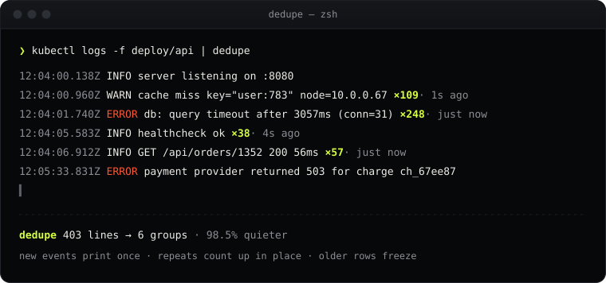

# dedupe

**Pipe noisy logs in. Get signal out.**

`dedupe` is a tiny CLI filter that collapses repeated and near-duplicate log lines in a live stream. Think of it as an alert-deduplication engine for your terminal: the 248th identical `db timeout` becomes a counter, and the one line that matters stays on screen.



## Install

```sh
go install github.com/narendraio/dedupe@latest
```

Or build from source:

```sh
git clone https://github.com/narendraio/dedupe
cd dedupe
make build        # -> ./bin/dedupe
make install      # -> $(go env GOPATH)/bin/dedupe
```

One static binary with no config and no daemon. Needs Go 1.23+ to build.

## Usage

```sh
tail -f app.log | dedupe                    # live, in-place counters
kubectl logs -f deploy/api | dedupe         # same thing, for pods
dedupe app.log                              # read files directly
dedupe --summary app.log > /dev/null        # just tell me what's loud
docker compose logs -f | dedupe --no-live   # plain stream, safe for pipes
journalctl -f | dedupe --window 30s > quiet.log
```

### Live mode (stdout is a terminal)

Every **new** kind of line prints once. When a repeat arrives, the existing row gets a lime `×248` badge and a `last seen 2s ago` label, updated in place. The newest 20 groups (`--live-rows`) stay live. Older rows freeze with their final count and the time they were last seen, and they scroll up like normal output. Redraws are capped at 20 fps, so a firehose won't shred your terminal.

```
2026-09-27T12:04:00Z INFO  server listening on :8080
2026-09-27T12:04:01Z ERROR db: query timeout after 3057ms (conn=31)  ×248 · just now
2026-09-27T12:04:05Z INFO  healthcheck ok  ×38 · 4s ago
2026-09-27T12:05:33Z ERROR payment provider returned 503 for charge ch_67ee87
```

### Pipe mode (stdout is a file or pipe, or `--no-live`)

This mode never rewrites anything, so it's safe for `grep`, files and CI logs. The first line of a group is written immediately. Once the group has been quiet for `--window` (default `5s`), or at end of input, one summary line follows:

```
2026-09-27T12:04:01Z ERROR db: query timeout after 3057ms (conn=31)
2026-09-27T12:04:05Z INFO  healthcheck ok
  ↳ repeated 247 more times (last 12:04:31) · 2026-09-27T12:04:01Z ERROR db: query timeout…
  ↳ repeated 37 more times (last 12:04:36) · 2026-09-27T12:04:05Z INFO  healthcheck ok
2026-09-27T12:05:33Z ERROR payment provider returned 503 for charge ch_67ee87
2026-09-27T12:05:33Z WARN  retrying charge in 2s
  ↳ repeated 4 more times (last 12:05:41)
```

The trailing excerpt tells you which group a summary belongs to. It's dropped when the summary sits right under its own line.

### `--summary`

When input ends, or when you hit Ctrl-C, `--summary` prints the top 10 groups to **stderr**:

```
  dedupe  12,408 lines → 37 groups  · 99.7% quieter

   COUNT  LAST      LINE
  ×9,812  12:04:31  2026-09-27T12:04:01Z ERROR db: query timeout after 3057ms (conn=31)
  ×1,907  12:04:29  2026-09-27T12:04:00Z WARN  cache miss key="user:783" node=10.0.0.67
     ×58  12:04:31  2026-09-27T12:04:06Z INFO  GET /api/orders/1352 200 56ms
```

## How it works

Every line is reduced to a **fingerprint**: volatile tokens are swapped for placeholders, and lines that share a fingerprint are one group.

| Token | Example | Becomes |
|---|---|---|
| Timestamps (ISO-8601, RFC 3339, CLF, syslog, klog, Go `log`, epoch s/ms/µs/ns) | `2026-09-27T12:04:31.123Z`, `[10/Oct/2000:13:55:36 -0700]`, `1714565071123` | `<ts>` |
| UUIDs | `3fa85f64-5717-4562-b3fc-2c963f66afa6` | `<uuid>` |
| IPv4 / IPv6 (with port or CIDR) | `10.0.0.12:5432`, `[::1]:8080` | `<ip>` |
| Hex ids, 8+ chars or `0x…` | `9fceb02d0ae5`, `0xc000123abc` | `<hex>` |
| Numbers | `3057ms`, `user42`, `1.5` | `#ms`, `user#`, `#` |
| Quoted values | `user="alice"`, `'config.yaml'` | `"…"` |
| ANSI colors, runs of whitespace | | removed / squashed |

So these two lines are the same event:

```
2026-09-27T12:04:31Z ERROR payment 3fa85f64-… failed: timeout after 30012ms
2026-09-27T12:09:02Z ERROR payment 7c9e6679-… failed: timeout after 30001ms
            ↓
<ts> ERROR payment <uuid> failed: timeout after #ms
```

A few details keep that from being too aggressive:

- **Structured logs stay meaningful.** JSON keys are never replaced, and neither are the values of `msg`, `message`, `error`, `level`, `event`, `reason`, `status` and a few other telling keys. `{"msg":"db timeout"}` and `{"msg":"disk full"}` stay apart.
- **Prose stays prose.** A free-standing quoted phrase like `"Observed a panic"` is kept, and apostrophes (`can't`) are not mistaken for quotes. Pass `--keep-quotes` to treat every quoted string as significant.
- **Code isn't an address.** `std::io::Error` is left alone; only real IPv6 addresses are replaced.

Under the hood: lines are read with no length limit (anything past 256 KiB is trimmed with a `…[+N bytes]` marker), invalid UTF-8 is tolerated, and fingerprinting runs in parallel across cores when input arrives in bulk while output order stays exact. That works out to about 150k lines/s on an 8-core laptop. Memory is bounded on endless streams of unique lines.

## Flags

| Flag | Default | Description |
|---|---|---|
| `--window` | `5s` | Pipe mode: a group ends (and its `↳ repeated N more times` line is written) after this long without repeats. |
| `--live-rows` | `20` | Live mode: how many recent groups keep updating in place. Capped to your terminal height. |
| `--no-live` | `false` | Never redraw in place. Print a plain stream even on a terminal. |
| `--summary` | `false` | At exit (EOF or Ctrl-C), print the top 10 groups to stderr. |
| `--keep-quotes` | `false` | Don't replace quoted strings with `"…"`. |
| `--color` | `auto` | `auto`, `always` or `never`. `auto` respects `NO_COLOR` and `TERM=dumb`. |
| `--version` | | Print the version and exit. |

Flags can go before or after file names. Use `-` as a file name to read stdin. Exit codes: `0` ok, `1` I/O error, `2` bad flags, `130` interrupted.

## Tips

- `dedupe` compares lines, not multi-line records. Stack traces collapse frame by frame, which is usually what you want anyway.
- Pipe mode uses wall-clock time, so `--window` is about how fast lines *arrive*, not the timestamps inside them.
- Want a single report instead of a stream? `dedupe --summary big.log > /dev/null`.

## License

[MIT](LICENSE) © 2026 Narendra Solanki. Part of a [tool-a-day](https://github.com/narendraio) series.
